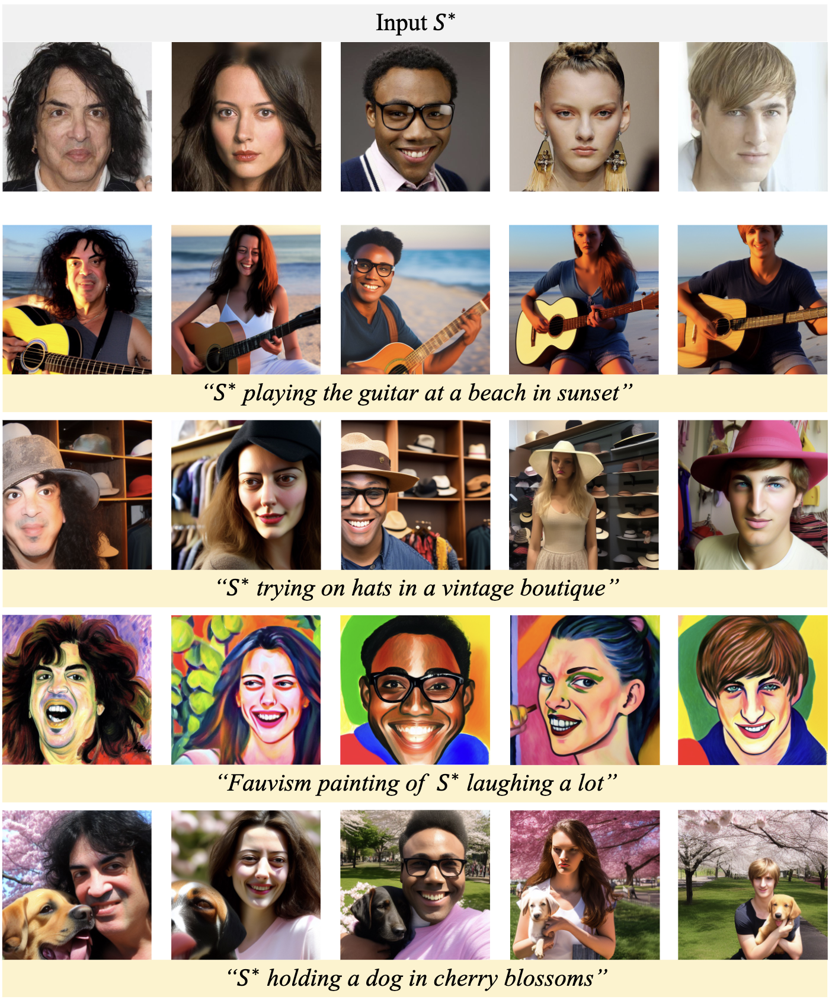

# Face2Diffusion (CVPR2024)
<a href='https://arxiv.org/abs/2403.05094'></a> &nbsp; 
<a href='https://mapooon.github.io/Face2DiffusionPage'></a> &nbsp; 
[](https://colab.research.google.com/github/mapooon/Face2Diffusion/blob/master/Face2Diffusion_Demo.ipynb) 


The official PyTorch implementation for the following paper:
> [**Face2Diffusion for Fast and Editable Face Personalization**](https://arxiv.org/abs/2403.05094),  
> Kaede Shiohara, Toshihiko Yamasaki,   
> *CVPR 2024*

# Changelog
2024/03/28 🔥 Released a demo code on Google Colab.  
2024/03/15 🔥 Released the full inference pipeline.  
2024/03/11 🔥  Released this repository and demo code.  

# Demo on Google Colab
[](https://colab.research.google.com/github/mapooon/Face2Diffusion/blob/master/Face2Diffusion_Demo.ipynb) 

# Recomended Development Environment
* GPU: NVIDIA A100
* CUDA: 12.2
* Docker: 535.129.03


# Setup
## 1. Build Docker Image
Build a docker image
```bash
docker build -t face2diffusion dockerfiles/
```
Execute docker using the following command (Please replace `/path/to/this/repository` with a proper one)
```bash
docker run -it --gpus all --shm-size 512G \
-v /path/to/this/repository:/workspace \
face2diffusion bash
```
Install some packages
```bash
bash install.sh
```

## 2. Download checkpoints
We provide checkpoints for [mapping network](https://drive.google.com/file/d/1Lf_mwMgme_HVYJCkViGr4TfGOfKw9PhE/view?usp=sharing) and [MSID encoder](https://drive.google.com/file/d/1DjUf-ib612SDDt86TRlsDkHqXTeYx030/view?usp=sharing). Download and place them to ```checkpoints/```.

# Demo
Generate images for an facial image and text prompt:
```bash
python3 inference_f2d.py \
--w_map checkpoints/mapping.pt \
--w_msid checkpoints/msid.pt \
-i input/0.jpg \ # input identity
-p 'f l eating bread in front of the Eiffel Tower' \ # input prompt
-o output.png \ # output file name
-n 8 \ # num of images to generate
```
Note: The identifier S* should be represented as "f l".

# Acknowledgements
We borrow some code from [InsightFace](https://github.com/deepinsight/insightface), [ICT](https://github.com/LightDXY/ICT_DeepFake), and [Pix2Word](https://github.com/google-research/composed_image_retrieval).


# Citation
If you find our work useful for your research, please consider citing our paper:
```bibtex
@inproceedings{shiohara2024face2diffusion,
  title={Face2Diffusion for Fast and Editable Face Personalization},
  author={Shiohara, Kaede and Yamasaki, Toshihiko},
  booktitle={Proceedings of the IEEE/CVF Conference on Computer Vision and Pattern Recognition (CVPR)},
  year={2024}
}
```